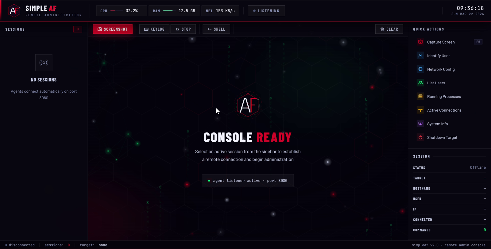
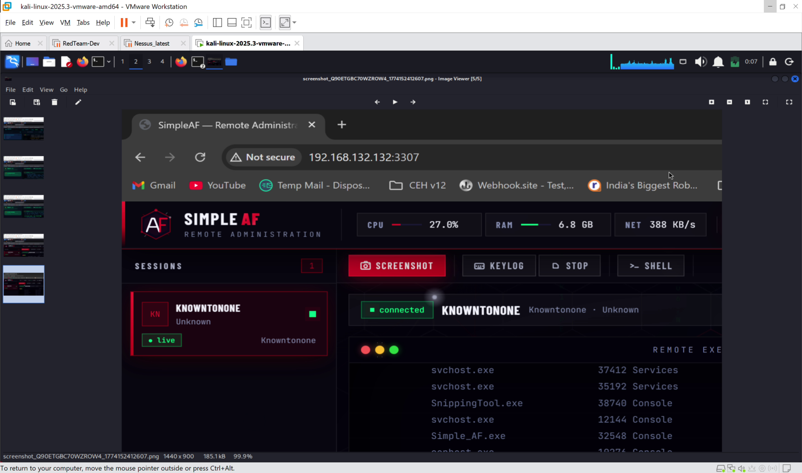
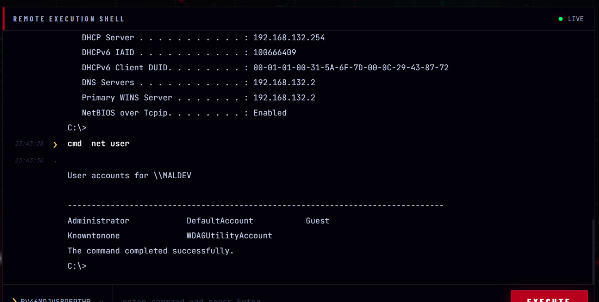

# SimpleAF

Minimal Rust implant + Node.js operator console, built for security research in authorized lab environments.

- **Implant** (`src/main.rs`): remote shell, keylogging with active-window capture, screenshots, Wi-Fi credential listing, mouse/keyboard control, HKCU Run-key persistence
- **Operator console** (`server.js` + `public/`): session list, interactive terminal, quick actions

## Demo

Screenshots from the March 2026 lab run (Kali attacker box + Windows 11 24H2 target).

*Operator console idle, waiting for implants.*

*Live session — `tasklist` output from the implant.*

*A captured screenshot arriving in the operator's image viewer.*

*Kaspersky Endpoint fully updated and cloud-connected during the test.*

*Interactive shell still active on the Kaspersky-protected host.*

Build & run:

    cargo build --release          # implant
    npm install && node server.js  # console on port 3307

The implant reads its C2 URL from the `C2_SERVER` environment variable (default `http://127.0.0.1:3307`).

**Educational/research use only. Use only on systems you own or are explicitly authorized to test.**
